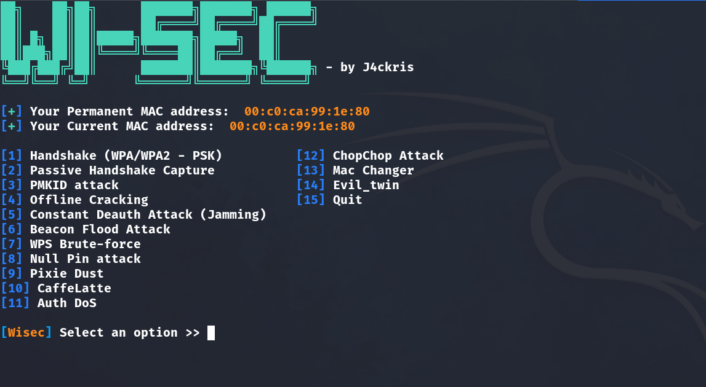

WiSec a WI-FI Penetration Testing tool that haves a lot of attacks for protocols like the **WPA2-PSK** and **WEP** encryption attacks.

The tool has been tested in **Kali Linux**, **Parrot OS**.

- All of these attacks works great with the **Alfa AWUS036NHA** antena.




## Attacks

- Deauthentication Attack

- Authentication Attack

- Beacon Flood Attack

- PMKID Attack

- Passive Attack

- Pixie Dust Attack

- Null Pin Attack

- WEP Protocol Attacks

- Offline Cracking Options

- Evil Twin Attacks


## Usage

> **To start WiSec**, you need to be **root** and then start it with this command.

```sh
./WiSec -n wlan0 # Change the interface name if it's different
```
