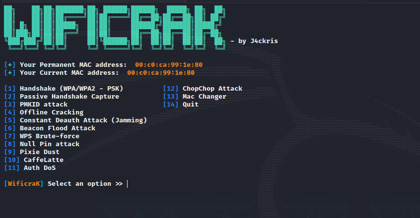

<p align="center">
  <h1 align="center">WiSec</h1>
</p>

## Introduction

WiSec is tool that allows yo to do most of the **WPA2-PSK** and **WEP** encryption attacks. The tool let's you crack previous files that you have captured using crunch or a wordlist.

The tool has been tested in **Kali Linux**, **Parrot OS**.

- All of these attacks works great with the **Alfa AWUS036NHA** antena.

## Attacks

- Deauthentication Attack

- Authentication Attack

- Beacon Flood Attack

- PMKID Attack

- Passive Attack

- Pixie Dust Attack

- Null Pin Attack

- WEP Protocol Attacks

- Offline Cracking Options

- Evil Twin Attacks


## Usage

> **To start WiSec**, you need to be **root** and then start it with this command.

```sh
./WiSec -n wlan0 # Change the interface name if it's different
```
## Requirements

> You don't need to install all the requirements manually, this will be check once you start the program.

    aircrack-ng
    reaver
    mdk4
    macchanger
    xterm
    hcxtools
    wash

## Demo

> Demo on a **Kali Linux**





## Disclaimer

Creator isn't in charge of any and has no responsibility for any kind of:

- Unlawful or illegal use of the project.
- Legal or Law infringement (acted in any country, state, municipality, place) by third parties and users.
- Act against ethical and / or human moral, ethic, and peoples of the world.
- Malicious act, capable of causing damage to third parties, promoted or distributed by third parties or the user through this software.

